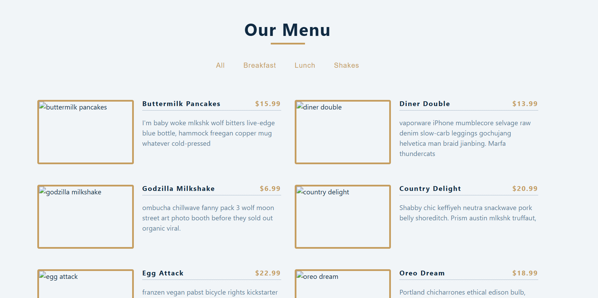

# menu
this project displays the set of menu

using useState hooks it sets list of menu from data js

display list of categories from item.categories with map method

to avoid duplication new set method is used

the catagories component display list of catagories button

the menu display the list

App js render catageires and menu components

# page looks like

# @copyright Bisrat
# October 30 2024